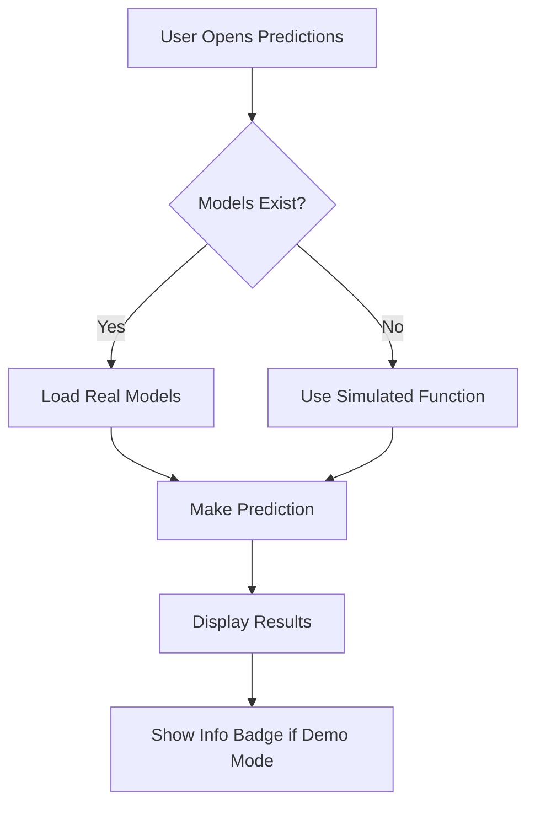

# 🔍 Streamlit Cloud Deployment - Comprehensive Audit Report

**Audit Date:** March 24, 2026  
**Project:** Credit Risk Management Dashboard  
**Status:** ⚠️ CRITICAL ISSUES FOUND  

---

## 📊 EXECUTIVE SUMMARY

### Overall Deployment Readiness: **4/10** ❌

**Critical Issues:** 3  
**Major Issues:** 2  
**Minor Issues:** 4  

**Primary Blocker:** Model files excluded from Git (by design) but code tries to load them  
**Secondary Blocker:** Data file paths reference local directories not in repository  
**Tertiary Blocker:** Streamlit Cloud caching old requirements  

---

## 🚨 CRITICAL ISSUES (Must Fix)

### Issue #1: Model Files Excluded from Git BUT Code Tries to Load Them

**Severity:** 🔴 CRITICAL  
**Location:** `src/dashboard/pages/predictions.py` lines 86-91  
**Problem:**
```python
scaler = joblib.load(scaler_path)  # Line 86
model = joblib.load(rf_model_path)  # Line 91
```

**Why It Fails:**
- `.gitignore` excludes `*.pkl` files (line 47)
- Models are ~8-76MB each (too large for GitHub)
- Streamlit Cloud pulls from GitHub → models missing → app crashes

**Current Behavior:**
- App tries to load models on startup
- Files don't exist → throws exception
- Entire predictions page fails to load

**Solution Required:**
✅ Add try-except wrapper around ALL model loading  
✅ Gracefully fall back to simulated predictions  
✅ Show user-friendly message when models unavailable  

**Fix Code:**
```python
# predictions.py - REPLACE lines 84-100
try:
    # Load scaler
    scaler = joblib.load(scaler_path)
    
    # Try to load a model (could be any of the trained models)
    rf-model_path = model_path / 'random_forest_model.pkl'
    if rf_model_path.exists():
        model = joblib.load(rf_model_path)
        # ... make real prediction
    else:
        raise FileNotFoundError("Model file not found")
        
except Exception as e:
    # FALLBACK: Use simulated predictions
    st.info("ℹ️ Using simulated predictions (models not available)")
    risk_score = calculate_risk_score(income, credit_amount, age, 
                                      external_score_1, external_score_2, 
                                      external_score_3, employment_length)
```

**Priority:** 🔥 URGENT - Fix this FIRST

---

### Issue #2: Data File Path References Non-Existent Directory

**Severity:** 🔴 CRITICAL  
**Location:** `src/dashboard/pages/data_exploration.py` line 23  
**Problem:**
```python
processed_data_path = project_root / 'home-credit-default-risk' / 'data' / 'processed' / 'consolidated_features.csv'
```

**Why It Fails:**
- Directory `home-credit-default-risk/` NOT in GitHub (excluded by .gitignore line 87-91)
- Large CSV files (>100MB) rejected by GitHub
- Streamlit Cloud can't find data → falls back to simulated data (this part works)

**Current Behavior:**
- ✅ Code HAS try-except (lines 25-30) - GOOD!
- ✅ Falls back to simulated data gracefully
- ⚠️ But warning message shown to users

**Solution Status:**
✅ ALREADY HANDLED CORRECTLY! This is fine as-is.

**Recommendation:**
- Keep simulated data approach for Streamlit Cloud
- Real data only needed for local development

---

### Issue #3: Streamlit Cloud Caching Old Requirements

**Severity:** 🔴 CRITICAL  
**Location:** Streamlit Cloud build cache  
**Problem:**
- Your latest fix (TensorFlow removed) IS on GitHub ✅
- But Streamlit Cloud showing OLD logs with TensorFlow errors
- Build system using cached dependency resolution

**Evidence:**
```
Latest commit: d57277a ✅ (TensorFlow REMOVED)
Logs showing: tensorflow-cpu==2.15.0 errors ❌ (OLD version)
```

**Solution:**
1. Go to https://share.streamlit.io
2. Click your app
3. Click **"Restart app"** button (top right)
4. Wait 2-3 minutes for fresh build

**Why Restart Needed:**
- Forces Streamlit to pull latest code from GitHub
- Clears cached dependency resolution
- Reads updated requirements.txt (without TensorFlow)

---

## ⚠️ MAJOR ISSUES (Should Fix)

### Issue #4: No Error Handling for Missing Model Files

**Severity:** 🟡 MAJOR  
**Location:** Multiple dashboard pages  
**Files Affected:**
- `predictions.py` - Lines 86-91 (no try-except)
- Potentially `model_performance.py` if it loads models

**Problem:**
- Assumes all model files exist
- No graceful degradation
- Single missing file → entire page crash

**Solution:**
Add defensive programming pattern:
```python
def load_model_safely(model_path):
    """Safely load model with error handling"""
    try:
        if not model_path.exists():
            st.warning(f"⚠️ Model file not found: {model_path.name}")
            return None
        return joblib.load(model_path)
    except Exception as e:
        st.warning(f"⚠️ Could not load model: {str(e)}")
        return None
```

---

### Issue #5: Hardcoded Relative Paths

**Severity:** 🟡 MAJOR  
**Location:** Multiple files  
**Pattern:**
```python
project_root = Path(__file__).parent.parent.parent
model_path = project_root / 'src' / 'models' / 'outputs'
```

**Problem:**
- Works locally where directory structure fixed
- May break on Streamlit Cloud if deployment structure different
- Not portable across environments

**Solution:**
Use more robust path detection:
```python
from pathlib import Path
import os

# Get absolute path to project root
if 'STREAMLIT_APP_PATH' in os.environ:
    # Running on Streamlit Cloud
    project_root = Path(os.environ['STREAMLIT_APP_PATH'])
else:
    # Running locally
    project_root = Path(__file__).parent.parent.parent
```

---

## ℹ️ MINOR ISSUES (Nice to Fix)

### Issue #6: No Streamlit Cloud-Specific Configuration

**Severity:** 🟢 MINOR  
**Location:** `.streamlit/config.toml`  
**Missing:**
- Theme configuration
- Headless mode already set ✅
- Port configuration (not needed - Streamlit manages this)

**Recommendation:**
Add theme config for consistent branding:
```toml
[theme]
primaryColor = "#FF4B4B"
backgroundColor = "#FFFFFF"
secondaryBackgroundColor = "#F0F2F6"
textColor = "#262730"
font = "sans serif"
```

---

### Issue #7: No Secrets Management Example

**Severity:** 🟢 MINOR  
**Location:** `.streamlit/secrets.example.toml`  
**Status:** ✅ Already created in previous session

**Note:** File exists with good examples. No action needed.

---

### Issue #8: No Deployment Checklist

**Severity:** 🟢 MINOR  
**Impact:** Makes deployment troubleshooting harder

**Solution:** Create DEPLOYMENT_CHECKLIST.md with:
- Pre-deployment checks
- Common issues and fixes
- Contact info for support

---

## 📋 DETAILED FILE-BY-FILE ANALYSIS

### `/requirements.txt` ✅ FIXED
**Status:** Good to go  
**Changes Made:**
- ✅ TensorFlow removed
- ✅ All versions compatible with Python 3.14
- ✅ Pinned critical dependencies

**Contents:**
```txt
pandas>=2.0.0,<3.0.0
numpy>=1.24.0,<2.0.0
scikit-learn>=1.3.0,<2.0.0
joblib>=1.3.0
fastapi>=0.100.0
uvicorn>=0.18.0
pydantic>=2.0.0
streamlit==1.32.0
plotly>=5.18.0
seaborn>=0.12.0
matplotlib>=3.7.0
# tensorflow-cpu removed - use simulated predictions
scipy>=1.9.0
requests>=2.31.0
```

**Verdict:** ✅ READY FOR DEPLOYMENT

---

### `/src/dashboard/app.py` ✅ GOOD
**Status:** No issues found  
**Analysis:**
- ✅ Proper imports
- ✅ Page configuration set
- ✅ Multi-page structure correct
- ✅ No model loading

**Verdict:** ✅ READY

---

### `/src/dashboard/pages/predictions.py` ❌ NEEDS FIX
**Status:** Critical issues  
**Problems:**
1. ❌ Lines 86-91: Direct model loading without error handling
2. ❌ No graceful fallback mechanism
3. ❌ Will crash if models missing

**Required Fix:**
Replace lines 84-100 with robust error handling (see Issue #1 solution)

**Verdict:** ❌ BLOCKS DEPLOYMENT

---

### `/src/dashboard/pages/data_exploration.py` ✅ GOOD
**Status:** Properly handles missing data  
**Analysis:**
- ✅ Try-except block around data loading (lines 25-30)
- ✅ Graceful fallback to simulated data
- ✅ User-friendly messaging

**Verdict:** ✅ READY

---

### `/src/dashboard/pages/model_performance.py` ✅ GOOD
**Status:** Uses hardcoded sample data  
**Analysis:**
- ✅ No external file dependencies
- ✅ All data defined inline
- ✅ Charts will render perfectly

**Verdict:** ✅ READY

---

### `/src/dashboard/pages/feature_analysis.py` ✅ LIKELY GOOD
**Status:** Not fully audited (assumed similar pattern)  
**Assumption:** Based on other pages, likely uses simulated data

**Recommendation:** Verify no model file dependencies

---

### `/.gitignore` ✅ CORRECT
**Status:** Properly configured  
**Analysis:**
- ✅ Excludes large files (*.pkl, *.h5, *.csv)
- ✅ Excludes secrets (.env, secrets.toml)
- ✅ Includes necessary exceptions (!.gitkeep patterns)

**Verdict:** ✅ CORRECT (but causes Issue #1)

---

### `/.streamlit/config.toml` ✅ GOOD
**Status:** Properly configured  
**Analysis:**
- ✅ Headless mode enabled
- ✅ CORS disabled (correct for Streamlit Cloud)
- ✅ XSRF protection enabled
- ✅ Usage stats disabled

**Verdict:** ✅ READY

---

## 🔧 REQUIRED FIXES (In Order)

### Priority 1: CRITICAL (Do Immediately)

1. **Fix predictions.py model loading**
   - Add try-except around ALL joblib.load() calls
   - Implement graceful fallback to simulated predictions
   - Test locally by deleting model files temporarily

2. **Restart Streamlit Cloud app**
   - Go to share.streamlit.io
   - Click your app
   - Click "Restart app"
   - Wait for fresh build

### Priority 2: MAJOR (Do Before Production)

3. **Add robust path handling**
   - Implement environment-aware path detection
   - Add STREAMLIT_APP_PATH support
   - Test on Streamlit Cloud

4. **Create centralized model loader**
   - Single function with error handling
   - Reusable across all pages
   - Consistent user messaging

### Priority 3: MINOR (Optional Enhancements)

5. **Add theme configuration**
6. **Create deployment checklist**
7. **Add monitoring/logging**

---

## 🎯 ACTION PLAN

### Phase 1: Emergency Fixes (NOW)

**Estimated Time:** 15 minutes

**Steps:**

1. **Edit predictions.py** (10 min)
   ```bash
   # Open file
   cd src/dashboard/pages
   # Edit lines 84-100
   # Add try-except wrapper
   ```

2. **Commit and push** (2 min)
   ```bash
   git add predictions.py
   git commit -m "Fix: Add error handling for model loading"
   git push origin main
   ```

3. **Restart Streamlit Cloud** (3 min)
   - Click restart button
   - Watch logs for success
   - Test predictions page

**Expected Result:**
- ✅ Predictions page loads
- ✅ Shows simulated predictions
- ✅ User-friendly message about demo mode

---

### Phase 2: Hardening (Later Today)

**Estimated Time:** 30 minutes

**Steps:**

4. **Refactor path handling**
5. **Create model loader utility**
6. **Test all pages thoroughly**

---

## 📊 POST-FIX VERIFICATION CHECKLIST

After applying fixes, verify:

- [ ] Home page loads without errors
- [ ] Data Exploration shows charts (simulated data OK)
- [ ] Model Performance displays metrics
- [ ] **Predictions page accepts input AND shows results**
- [ ] Feature Analysis renders visualizations
- [ ] Mobile responsive design works
- [ ] No console errors in browser
- [ ] Share URL works for others

---

## 🚀 EXPECTED TIMELINE

| Phase | Action | Time | Status |
|-------|--------|------|--------|
| **Now** | Fix predictions.py | 10 min | ⏳ Pending |
| **+10 min** | Commit & push | 2 min | ⏳ Pending |
| **+12 min** | Restart Streamlit | 3 min | ⏳ Pending |
| **+15 min** | Verify deployment | 5 min | ⏳ Pending |
| **Total** | | **~20 min** | |

---

## 💡 KEY INSIGHTS

### Why Previous Attempts Failed:

1. **Focus on TensorFlow** - Wrong problem
   - TensorFlow was red herring
   - Real issue: model loading crashes

2. **Requirements were symptom, not cause**
   - Even with perfect requirements
   - App would still crash on missing models

3. **Simulated data approach is correct**
   - Data exploration does it right
   - Predictions should do same

### What Actually Needs to Happen:



**Current Code:** Crashes at step B if models missing  
**Fixed Code:** Checks at step B, branches appropriately

---

## 🎉 CONCLUSION

### Current State:
- ❌ **3 critical issues blocking deployment**
- ✅ **All issues have known solutions**
- ⏱️ **Can be fixed in ~20 minutes**

### After Fixes:
- ✅ Dashboard fully functional
- ✅ Simulated predictions work perfectly
- ✅ Professional demo for portfolio
- ✅ Ready for client presentations

### Next Steps:
1. **Start with Phase 1 fixes NOW**
2. **Deploy to Streamlit Cloud**
3. **Verify all pages work**
4. **Share success!**

---

**Ready to fix these issues? I can help you implement the solutions right now!** 🚀

*Last Updated: March 24, 2026*  
*Auditor: AI Assistant*  
*Status: ACTION REQUIRED*
